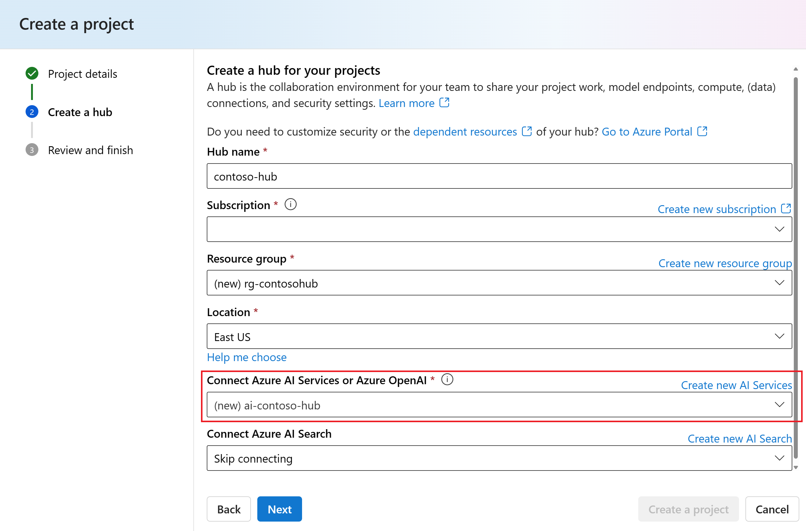
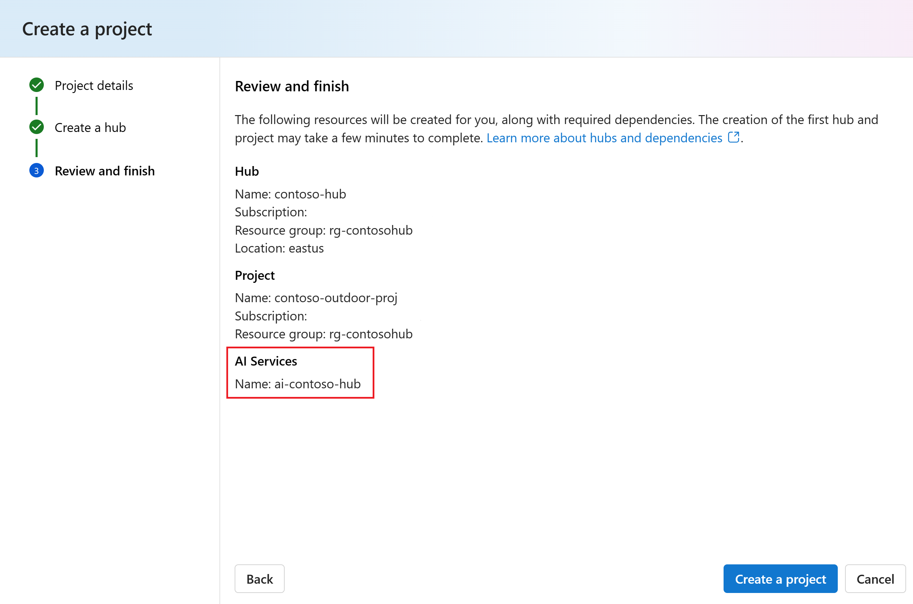
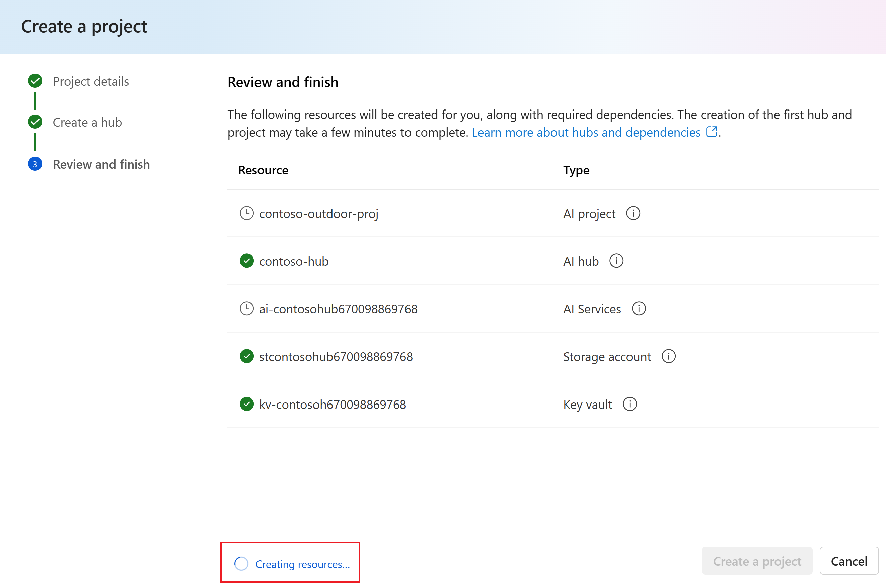
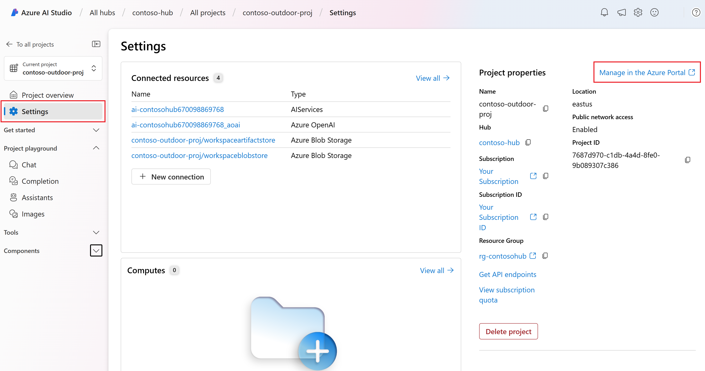

# Lab 1. Azure AI Workshop Environment Setup

## Introduction 
> [!NOTE]
>This is a **10-minute** lab that will give you a hands-on introduction to setting up the environment for the workshop.

## Learning Objectives

By the end of this workshop, you should be able to:
// This is a placeholder for the learning objectives. The objectives should be a bulleted list of the skills that the learner will acquire by completing the lab.

## Lab Scenario
> [!NOTE]
>In this workshop lab, you will:

- Create a new Azure AI Studio Hub
- Create a new Azure AI Project

### Task 
During this lab we will develop a travel companion application that leverages Large Language Models (LLMs) to provide personalized travel recommendations, itinerary planning, and real-time assistance to travellers. The labs will focus on fine-tuning a GPT model using Azure AI Studio and a code-first approach using Python and Microsoft Olive.

We will focus on the specific areas 
- Setting up Azure AI Studio
- Prepare Training Data
- One-Button Fine-Tuning with Azure AI Studio
- Import a pre-trained model into the project.
- Deploy the Fine-Tuned Model
- Test the model by querying travel recommendations and itinerary planning.
- Python code to fine-tune GPT model with the prepared data.
- Use Microsoft Olive for model optimization, including pruning and quantization.
- Evaluate the model's performance and compare it with the Azure-deployed model.
- Evaluate which method provided better performance and insights.
- 
### Set up the environment for the workshop

## Create an Azure AI hub

You need an [Azure AI Studio hub](https://ai.azure.com) in your Azure subscription to host projects. You can either create this resource while creating a project, 

1. Go to [Azure AI Studio](https://ai.azure.com)
2. In the **Management** section, select **All hubs**, then select **+ New hub**. Create a new hub with the following settings:
    - **Hub name**: *A unique name*
    - **Subscription**: *Your Azure subscription*
    - **Resource group**: *Create a new resource group with a unique name, or select an existing one*
    - **Location**: *Make a **random** choice from any of the following regions*\*
        - Australia East
        - Canada East
        - East US
        - East US 2
        - France Central
        - Japan East
        - North Central US
        - Sweden Central
        - Switzerland North
        - UK South
    - **Connect Azure AI Services or Azure OpenAI**: *Select to create a new AI Services or use an existing one*
    - **Connect Azure AI Search**: Skip connecting

> [!NOTE] 
> Azure OpenAI resources are constrained at the tenant level by regional quotas. The listed regions include default quota for the model type(s) used in this exercise. Randomly choosing a region reduces the risk of a single region reaching its quota limit in scenarios where you are sharing a tenant with other users. In the event of a quota limit being reached later in the exercise, there's a possibility you may need to create another resource in a different region.

After the Azure AI hub has been created, it should look similar to the following image:

1. Open a new browser tab (leaving the Azure AI Studio tab open) and browse to the Azure portal at [https://portal.azure.com](https://portal.azure.com?azure-portal=true), signing in with your Azure credentials if prompted.
1. Browse to the resource group where you created your Azure AI hub, and view the Azure resources that have been created.

    

1. Return to the Azure AI Studio browser tab.
1. View each of the pages in the pane on the left side of the page for your Azure AI hub, and note the artifacts you can create and manage. On the **Connections** page, observe that connections to Azure OpenAI and AI services have already been created.

### Create a new project

An Azure AI hub provides a collaborative workspace within which you can define one or more *projects*. Let's create a project in your Azure AI hub.

1. In [Azure AI Studio](https://ai.azure.com), ensure you're in the hub you just created (you can verify your location by checking the path at the top of the screen).
1. Navigate to **All projects** using the menu on the left.
1. Select **+ New project**.
1. In the **Create a new project** wizard, create a project with the following settings:
    - **Current hub**: *Your AI hub*
    - **Project name**: *A unique name for your project*

5. On the Review and finish page, you see the Azure AI services resource name and other settings to review.

6. Review the project details and then select Create a project. You see progress of resource creation and the project is created when the process is complete.

7. Wait for your project to be created. When it's ready, it should look similar to the following image:

8. View the pages in the pane on the left side, expanding each section, and note the tasks you can perform and the resources you can manage in a project.
To create a project in Azure AI Studio, follow these steps:

Go to the Home page of [Azure AI Studio](https://ai.azure.com).

**Note:** To create a hub, you must have Owner or Contributor permissions on the selected resource group. It's recommended to share a hub with your team. This lets you share configurations like data connections with all projects, and centrally manage security settings and spend. For more options to create a hub, see how to create and manage an Azure AI Studio hub. A project name must be unique between projects that share the same hub..

**Tip:** Especially for getting started it's recommended to create a new resource group for your project. This allows you to easily manage the project and all of its resources together. When you create a project, several resources are created in the resource group, including a hub, a container registry, and a storage account.

Once a project is created, you can access the playground, tools, and other assets in the left navigation panel.

On the project Settings page you can find information about the project, such as the project name, description, and the hub that hosts the project. You can also find the project ID, which is used to identify the project via SDK or API.

Name: The name of the project corresponds to the selected project in the left panel.
Hub: The hub that hosts the project.
Location: The location of the hub that hosts the project. For supported locations, see Azure AI Studio regions.
Subscription: The subscription that hosts the hub that hosts the project.
Resource group: The resource group that hosts the hub that hosts the project.
Select Manage in the Azure portal to navigate to the project resources in the Azure portal.

## Create your Cloud Compute Resources

1. Under **Settings**, select **Create compute**.

    

1. Select your **Virtual machine type** as **GPU**. *Filter* the list of **Virtual machine size** on **A100**: 
    
    
    
    Select a VM you have available quota for.

1. Select **Review+Create** and then **Create**.
