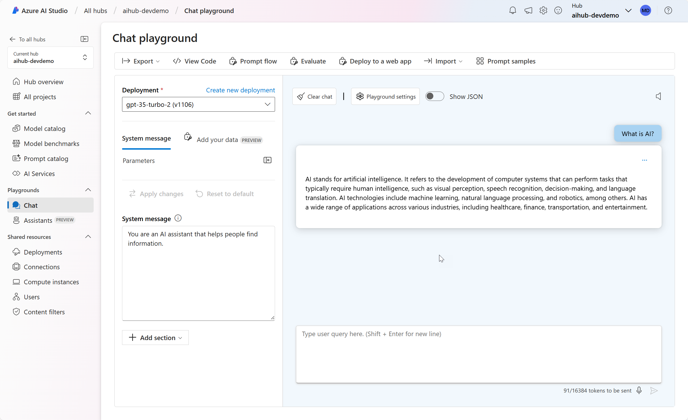

# Lab 4. Deploy an AI Model to a cloud endpoint using Azure AI 

## Introduction 

> [!NOTE]
>This is a **30-minute** exercise, you will successfully fine-tune the GPT model using Azure AI Studio one deployment. Please note that the fine-tuning process can take a considerable amount of time.

## Learning Objectives

By the end of this workshop, you should be able to:
1. Deploy a standard model using Azure AI Studio model deployment.
2. Deploy the fine-tuned model using Azure AI Studio model deployment.

## Deploy and test a model

A full exploration of all of the development options available in Azure AI Studio is beyond the scope of this exercise, but we'll explore some basic ways in which you can work with models in a project.

1. In the pane on the left for your project, in the **Components** section, select the **Deployments** page.
1. On the **Deployments** page, in the **Model deployments** tab, select **+ Deploy model**.
1. Search for the **gpt-35-turbo** model from the list, select and confirm.
1. Deploy the model with the following settings:
    - **Deployment name**: *A unique name for your model deployment*
    - **Deployment type**: Standard
    - **Model version**: *Select the default version*
    - **AI resource**: *Select the resource created previously*
    - **Tokens per Minute Rate Limit (thousands)**: 5K
    - **Content filter**: DefaultV2
    - **Enable dynamic quota**: Disabled
      
    > **Note**: Reducing the TPM helps avoid over-using the quota available in the subscription you are using. 5,000 TPM is sufficient for the data used in this exercise.

1. After the model has been deployed, in the deployment overview page, select **Open in playground**.
1. In the **Chat playground** page, ensure that your model deployment is selected in the **Deployment** section.
1. In the chat window, enter a query such as *What is AI?* and view the response:

    

## Lab Scenario
To integrate the fine-tuned model with an application, you need to deploy the model to make it accessible for real-time inference. This process involves registering the model, creating an online endpoint, and deploying the model.

## Lab Outline
In this exercise, you will:

- Set the model name, endpoint name, and deployment name for deployment.
- Register the fine-tuned model in the Azure Machine Learning workspace.
- Create an online endpoint.
- Deploy the registered fine-tuned GPT model.

## Deploy the fine-tuned model

When fine-tuning has successfully completed, you can deploy the model.

1. Select the fine-tuned model. Select the **Metrics** tab and explore the fine-tune metrics.
1. Deploy the fine-tuned model with the following configurations:
    - **Deployment name**: *A unique name for your model, you can use the default*
    - **Deployment type**: Standard
    - **Tokens per Minute Rate Limit (thousands)**: 5K
    - **Content filter**: Default

## Test the fine-tuned model

Now that you deployed your fine-tuned model, you can test the model like you can test any other deployed model.

1. When the deployment is ready, navigate to the fine-tuned model and select **Open in playground**.
1. In the chat window, enter the query `What can you do?`
    Notice that even though you didn't specify the system message to instruct your model to answer travel-related questions, the model already understands what it should focus on.
1. Try with another query like `Where should I go on holiday for my 30th birthday?`
