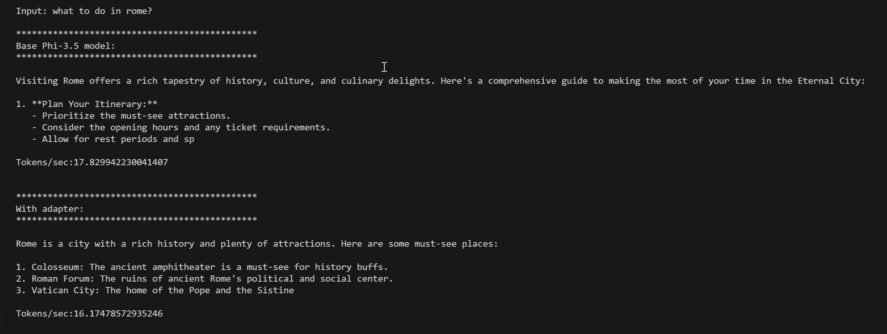

# Lab 7. Consumption of your Model within an Application 

## Introduction

> [!NOTE]
>This is a **10-minute** workshop that will give you a hands-on introduction to the core concepts of using a code first approach to consuming a deployed model endpoint. 

## Learning Objectives

By the end of this workshop, you should be able to:
1. Integrate the on-device Phi-3.5-mini-instruct base model (from Lab 5) with the application.
1. Set the on-device fine-tuned LoRA adapter (from Lab 5) during inference time in the application.
1. Integrate the custom fine tuned GPT-3.5-Turbo Model in the cloud (from Lab 4) with the application using the Azure OpenAI Client SDK.
1. Compare the results of the models

## Lab Scenario
In this lab you have the option of utilizing either 

1. a .NET console application, or 
1. a Python Application

The application allows you to compare and contrast the results from the on-device models:

- Phi-3.5-Mini-Instruct base model (quantized with AWQ) - i.e. no finetuning.
- the Fine-tuned LoRA adapter

You'll also see the results from your GPT-3.5-Turbo fine-tuned Model in the cloud.

You should notice that the on-device models deliver performance that is faster than read speed - a key metric for user experience in chat applications. They are also not impacted by rate limits of a cloud AI model endpoint. 

You can **use both on-device and cloud AI**: you can route user prompts to either on-device or cloud AI models based on a *routing strategy*:

- *Random* - you can draw a random number so that x% of user prompts are handled by the on-device AI. The rationale would be to reduce load on your cloud AI endpoint for either reduced COGs.
- *Prompt classication* - you can classify prompts for on-device or cloud inference. For example, you could classify prompts on simplicity with the more simple prompts being routed to an on-device SLM with more complex prompts being routed to an LLM in the cloud. You can also classify prompts based on the intent of the prompt and route to different FT adapters.
- *Privacy* - you can route private user interactions to on-device AI.
- *Agents* - In multi-agent flow, some components may be inferenced by on-device AI.

## Setup

### Connect to your Azure AI Compute

You'll connect to the Azure AI compute using the remote feature in VS Code. Open your VS Code desktop application:

1. Open the **command palette** using  **Shift+Ctrl+P**
1. In the command palette search for **AzureML - remote: Connect to compute instance in New Window**.
1. Follow the on-screen instructions to connect to the Compute. This will involve selecting your Azure Subscription, Resource Group, Project and Compute name you set up in Lab 1.


## Open a terminal in VSCode

```
cd Ignite_FineTuning_workshop/lab/workshop-instructions/Lab7_Consumption_in_app
```

## Option 1. Using Python application

> [!NOTE]
> You will be running the on-device ONNX models on the **CPU** of the A100, *not* the GPU. This is to give you a flavour of the inference performance on a CPU device, which are more ubiquitous than GPU. The performance of the Phi-3.5-mini model (AWQ quantized and ONNX optimized) is:
>
> - CPU: ~19tokens/sec
> - GPU: ~100tokens/sec
>
> Human read speed is 3-5tokens/sec.

1. Ensure you are running the `olive-ai` conda environment from Lab 5, which has all the python dependencies to run this app:
   ```bash
   conda activate olive-ai
   ```
1. **Create a new file** in the Lab7-Consumption-In-App directory called `.env`. Add to the **.env** file the following environment variables:
   ```bash
   ENDPOINT_URL=ENDPOINT_URL_OF_FT_MODEL
   DEPLOYMENT_NAME=DEPLOYMENT_NAME
   AZURE_OPENAI_API_KEY=KEY
   ```
   You can get the URL, deployment name and Key from the Azure AI Studio **Models+endpoints** page by selecting the **Get endpoint** button.
1. Run the application:
   ```bash
   python app.py
   ```

1. Enter a prompt, for example "what to do in rome?".

You should notice that the adapter gives a more concise and relevant answer than the base model:



## Option 2. Using the .NET application 

1. Install .NET 8.0 using the following bash command:
   ```bash
   sudo apt-get update 
   sudo apt-get install -y dotnet-sdk-8.0
   ```
1. Go to `scripts/ChatWithSLM.Console/Utils/GenAI.cs` and update the following variables with the information from your Azure Open AI model deployment:
   ```csharp
   private static string aoai_endpoint = "Your Azure OpenAI GPT Fine tuned GPT-3.5 endpoint";
   private static string aoai_key = "Your Azure OpenAI GPT-3.5 Fine tuned endpoint key";
   private static string aoai_model = "Your Azure OpenAI GPT-3.5 Fine tuned endpoint deployment";
   ```
   You can get the URL, deployment name and Key from the Azure AI Studio **Models+endpoints** page by selecting the **Get endpoint** button.

1. Run the console application
   ```bash
   cd scripts/ChatWithSLM.Console
   dotnet run
   ```
1. Select Option 1.
1. Enter a prompt. For example: "what to do in rome?".

You should see the following results - notice how the adapter has given a more consise and precise answer:


## A note on downloading additional ONNX Models from Hugging face 

There are over [200 ONNX models available on Hugging Face to bake into your applications](https://huggingface.co/onnx-community). You download them using either the HuggingFace CLI or using git:

```
git lfs install
git clone https://huggingface.co/<ModelID>
# Example git clone https://huggingface.co/onnx-community/Llama-3.2-1B-Instruct-ONNX
```
