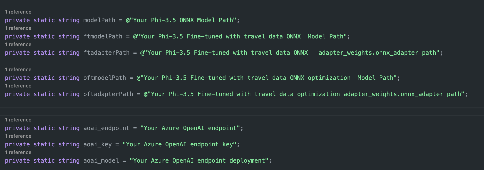

# Lab 7. Consumption of your Model within an Application 

## Introduction

> [!NOTE]
>This is a **10-minute** workshop that will give you a hands-on introduction to the core concepts of using a code first approach to consuming a deployed model endpoint. 

## Learning Objectives

By the end of this workshop, you should be able to:
1. Integrate the custom fined Phi local model with the application.
1. Intergrate the custom fine tuned GPT Model with the application.
2. Compare the results of the models

## Lab Scenario
In this lab you utilise a .NET console application or a Python Application to validate the following scenarios 

1. Chat with and evaliate resulting messages from various models:
- Phi-3.5 Mini Instruct ONNX Model from Hugging Face https://huggingface.co/microsoft/Phi-3.5-mini-instruct-onnx
- Phi-3.5 ONNX OLIVE Optimized fine tuned Model you created in Lab5
- GPT-.3.5 fine tuned Model your created in Lab3
3. Evaluation - this will allow you to compare the resulting messages, speed and quality.
4. Exit the application to complete this lab 

## Setup

### Connect to your Azure AI Compute

You'll connect to the Azure AI compute using the remote feature in VS Code. 

1. Open your **VS Code desktop application**:
1. If you have previously used your remote ML Compute this may be automatically loaded.
1. If your ML Compute is not connected Open the **command palette** using  **Shift+Ctrl+P**
1. In the command palette search for **AzureML - remote: Connect to compute instance in New Window**.
1. Follow the on-screen instructions to connect to the Compute. This will involve selecting your Azure Subscription, Resource Group, Project and Compute name you set up in Lab 1.

## Open a terminal in VSCode

In **VS Code**, you can open a new terminal with **Ctrl+J** and clone this repo:

Your terminal 

```
azureuser@compute:~/cloudfiles/code$ 

```

To open VS Code in the relevant folder execute the following command in the terminal, which will open a new window:

```bash
cd ~/localfiles
cd Ignite_FineTuning_workshop/lab/workshop-instructions/Lab7_Consumption_in_app
```

## Option 1. Using Python application

> [!NOTE]
> You will be running the model on the **CPU** of the A100, *not* the GPU. This is to give you a flavour of the inference performance on a CPU device, which are more ubiquitous.

1. Open a **terminal** within your VScode A100 Session
1. Ensure you are running the `olive-ai` environment from Lab 5:
   ```bash
   conda activate olive-ai
   ```
1. Run the application using the base model:
   ```bash
   python app.py \
    -m ../Lab5-Optimize-Model/models/phi/onnx-ao/model \
    -g
   ```

   Try the following prompt

   ```
   What is a nice place to goto in summer?
   ```
   Evaluate your response looking at time and number of tokens.

   Try some more prompts.

   To exit **Ctrl+C**
   
1. Run the application using the base model + Fine-tuned Adapter:
   ```bash
   python app.py \
    -m ../Lab5-Optimize-Model/models/phi/onnx-ao/model \
    -a ../Lab5-Optimize-Model/models/phi/onnx-ao/model/adapter_weights.onnx_adapter \
    -g
   ```

   Try the following prompt

   ```
   What is a nice place to goto in summer?
   ```
   Evaluate your response looking at time and number of tokens.

   Try some more prompts.

   To exit **Ctrl+C**

## Option 2.Using the .NET application 

This application requires .NET to be installed on the A100 compute node

## Setup .NET

Close the VS Code Terminal 

```
exit
```
Open a new VS Code terminal **Ctrl+J** 

```
azureuser@compute:~/cloudfiles/code$ 
```
```bash
cd ~/localfiles
cd Ignite_FineTuning_workshop/lab/workshop-instructions/Lab7_Consumption_in_app/scripts/ChatSLM.Console
```
 
### Install .NET 8.

```
sudo apt-get update 
sudo apt-get install -y dotnet-sdk-8.0
```

### Edit your Model Locations in VSCode  

Navigate to the folder in **VSCode solution** select **file** **open folder** add '/home/azureuser/localfiles/Ignite_FineTuning_workshop/lab/workshop-instructions/Lab7_Consumption_in_app/scripts/ChatSLM.Console/'

## Running fine-tuned GPT model in the cloud 

Open `ChatWithSLM.Console/Utils/GenAI.cs` in VSCode and add your onnx models path, and save the file.

You ONNX Path will be in the following format


> [!NOTE]
> For the Workshop Environment the we have provide copies of models in the `model`folder located on the desktop 

```
private static string oftmodelPath = @"/home/azureuser/localfiles/Ignite_FineTuning_workshop/lab/workshop-instructions/Lab5-Optimize-Model/models/phi/onnx-ao/model";    
private static string oftadapterPath = @"/home/azureuser/localfiles/Ignite_FineTuning_workshop/lab/workshop-instructions/Lab5-Optimize-Model/models/phi/onnx-ao/model/adapter_weights.onnx_adapter";

```

The Azure Open AI Key can be found in deployments and select your deployed GPT-35 Fine Tuned Model +++https://ai.azure.com+++ open the playground select **view code** select curl and then **key authentication** to find the **Endpoint** and **API Key**

```
    Endpoint = "https://*******.openai.azure.com/";
    Key = "********";
    Model Name = "****";

``` 




## Running console application

1. Open a VSCode **Terminal** ensure your in '/workshop-instructions/Lab7_Consumption_in_app/scripts/ChatSLM.Console' folder
1. Run the following command to start the .NET application 

```
dotnet run
```
You can choose two different scenarios

1. Experience of different models based on travel data

2. Experience of models before and after optimization

As shown in the figure


Try the following prompt

```
   What is a nice place to goto in summer?
```
 
   Evaluate your response looking at time and number of tokens.

   Try some more prompts.

   To exit **Ctrl+C**

### Downloading Additional ONNX Models from Hugging face 

Evaluate using other onnx model 

You can simply download and evaluate additional models from `https://huggingface.co` use the **search** to search for additional models for optimized models we recommend the +++https://huggingface.co/onnx-community+++ select the new model card download the new model and replace the model name in the Python or .NET application.

```
git lfs install
git clone https://huggingface.co/<ModelID>
# Example git clone https://huggingface.co/microsoft/Phi-3.5-mini-instruct-onnx
# Example git clone https://huggingface.co/onnx-community/Llama-3.2-1B-Instruct-ONNX
```
