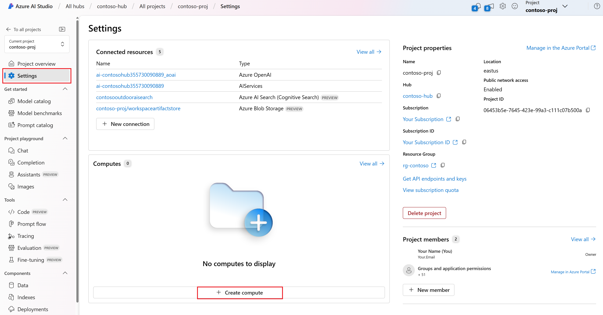

# Optimize model for on-device inference

> [!NOTE]
>This is a **20-minute** workshop that will give you a hands-on introduction to the core concepts of optimizing models for on-device inference using Olive.

## Learning Objectives

By the end of this workshop, you should be able to:

- Quantize an AI Model.
- Fine-tune a quantized model.
- Generate LoRA adapters for efficient on-device inference.

## Prerequisite: Create Azure AI Compute
You'll need the following an Azure AI Compute Instance, which can be created using the following steps:

1. Sign in to [Azure AI Studio](https://ai.azure.com) and select your project. If you don't have a project already, first create one [following this guide](https://learn.microsoft.com/en-us/azure/ai-studio/how-to/create-projects?tabs=ai-studio).
1. Under **Settings**, select **Create compute**.
    
1. Select your **Virtual machine type** as **GPU**. *Filter* the list of **Virtual machine size** on **A100**: 
    
    Select a VM you have available quota for.
1. Select **Review+Create** and then **Create**.

## 📖 Instructions

### 1. Clone this repo

On your Azure AI Compute Instance, run the following commands in a terminal window. In VS Code, you can open a new terminal with **Ctrl+j**.

```bash
cd ~/cloudfiles
git clone https://github.com/Azure/Ignite_FineTuning_workshop.git
```

### 2. Open Folder in VS Code

In your Azure AI VS Code, open the clone repo folder by selecting **File** > **Open Folder**.

Choose the following path: `lab/workshop-instructions/lab5-optimize-model`

### 3. Install dependencies

Open a terminal window in VS Code in your Azure AI Compute Instance (tip: **Ctrl+j**) and execute:

```bash
conda create -n -y olive-ai python=3.11
conda activate olive-ai
pip install -r requirements.txt
```

#### 4. Run the notebook

Open the `olive-optimization.ipynb` and follow the instructions contained in the Python Notebook.


